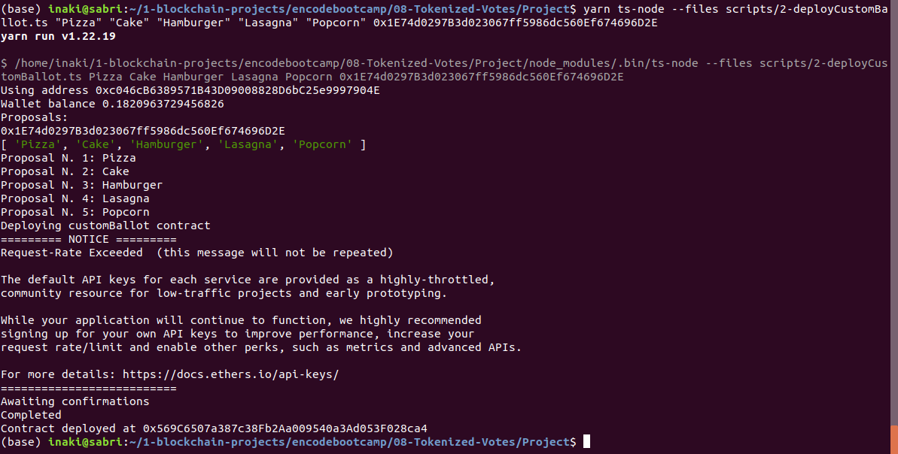

### Group 8

# Members

- Aimen Sahnoun
- Marshal Nganunu
- Celal Aksu
- Gabriel Horvart
- Ryan Chipwanya
- Inaki Cervera-Marzal

# Deployment

## 1- Vote contract deployment

RUNING SCRIPT:
`yarn ts-node ./scripts/1-deployVoteToken.ts`

CONTRACT ADDRESS  0x9E32540308BA6E517F42695456a366fA78fF2834

OUTPUT (screenshot of a terminal as the output):

Rinkeby etherscan screenshot:

## 2- CustomBallot.sol deployment

RUNING SCRIPT: 
`yarn ts-node ./scripts/2-deployCustomBallot.ts "Pizza" "Cake" "Hamburger" "Lasagna" "Popcorn" 0x9E32540308BA6E517F42695456a366fA78fF2834`

Input args:
Proposals: "Pizza" "Cake" "Hamburger" "Lasagna" "Pocorn"

VoteToken Address: 0x9E32540308BA6E517F42695456a366fA78fF2834

CONTRACT ADDRESS  0xFCED99536D34c0fF0E33c999cF2F86c70BA53e7B

OUTPUT (screenshot of a terminal as the output):

Rinkeby etherscan screenshot:

## 3- Mint MyToken Script

Runing script ( Script mints 10 MTK )

`yarn ts-node ./scripts/mintToken.ts 0x9E32540308BA6E517F42695456a366fA78fF2834 0x56491d3F87382b3fF39683B78b04457E06C40A89`

First Address is Token addres
Second address is mint to address

OUTPUT:

Transaction:
https://rinkeby.etherscan.io/tx/0x5ab6f9928469a0b26806336f99523c9259d8339300294c75f28db99af5456326

Metamask:

